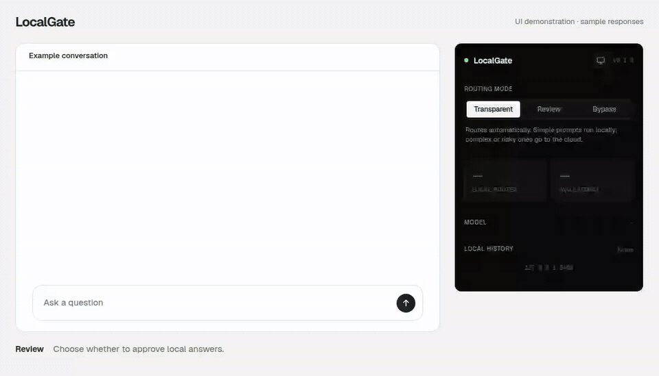
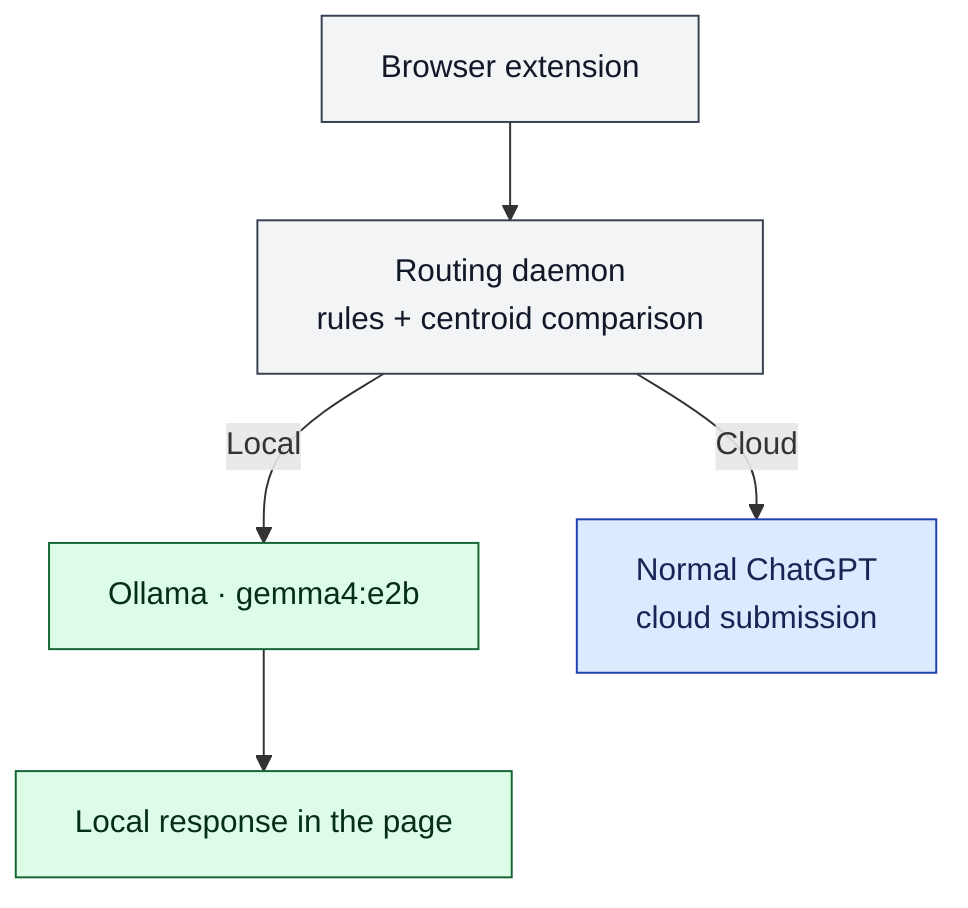

# LocalGate

LocalGate is a research prototype for trying local-or-cloud routing in ChatGPT. A Chrome
extension and daemon on your computer route prompts either to Ollama or onward to ChatGPT.

[Demo](#demo) · [Get started](#get-started) · [Routing modes](#routing-modes) · [Troubleshooting](#troubleshooting)

## Demo

[](./assets/localgate-demo.mp4)

LocalGate UI demonstration with sample responses in a controlled environment. Model output and
displayed timings are illustrative, not benchmark measurements. [Watch the sharper MP4](./assets/localgate-demo.mp4) · [Light screenshot](./assets/localgate-light.png) · [Dark screenshot](./assets/localgate-dark.png)

## Get started

> [!CAUTION]
> LocalGate does not guarantee privacy. In the default Transparent mode, cloud rules, uncertain
> classifications, daemon errors, and routing timeouts send the prompt to ChatGPT. If local
> generation itself fails, LocalGate shows the failure and restores the prompt; it does not
> silently retry that generation in the cloud. Typing into the ChatGPT webpage is not guaranteed
> private, even when LocalGate answers the request locally.

You need Chrome or another Chromium browser, [uv](https://docs.astral.sh/uv/getting-started/installation/),
Python 3.12 or newer, and [Ollama](https://ollama.com/download). The setup below uses Python
3.13, the version tested for this release.

1. Start Ollama if it is not already running, then download the local model:

   ```console
   ollama serve
   ```

   In another terminal:

   ```console
   ollama pull gemma4:e2b
   ```

2. Clone LocalGate and install the locked Python environment:

   ```console
   git clone https://github.com/LocalgateOrg/localgate.git
   cd localgate
   uv sync --locked --python 3.13
   ```

3. Start the daemon and leave it running:

   ```console
   uv run localgate-daemon
   ```

   The bundled extension expects the daemon at its default address,
   `http://127.0.0.1:8400`. On the first run, the daemon may download the
   `BAAI/bge-small-en-v1.5` embedding model.

4. Open `chrome://extensions`, turn on **Developer mode**, choose **Load unpacked**, and select
   the repository's `extension` directory.

5. Open or refresh `https://chatgpt.com`. The LocalGate toolbar popup should report that the
   daemon and Ollama are available. Transparent routing is enabled by default.

## Routing modes

| Mode | What happens |
| --- | --- |
| **Transparent** (default) | LocalGate routes automatically. Simple prompts can run through Ollama; prompts that are complex, risky, current, tool-dependent, file-dependent, or uncertain continue to ChatGPT. |
| **Review** | When the classifier proposes the local route, LocalGate asks you to approve it. Choosing cloud, dismissing the review, or letting it time out sends the prompt to ChatGPT. Cloud decisions do not need approval. |
| **Bypass** | Every prompt goes directly to ChatGPT without daemon classification or local generation. |

## How it works



The router uses explicit cloud rules first, including requests for web or current information,
external tools, files, media, high-stakes advice, complex research, and prompts over 4,000
characters. It then embeds the prompt with `BAAI/bge-small-en-v1.5` and compares it with simple
and complex prompt centroids. This release does not use the research ModernBERT classifier.

Local generation receives the current prompt only. It does not receive earlier ChatGPT or
LocalGate turns as model context, even though completed local turns can appear in the same
conversation on screen.

## Settings and local data

The popup lets you change routing mode, follow your system/light/dark theme, inspect routing
counts and latency, and access LocalGate's local-history control.

Completed local exchanges, including their prompts and responses, are stored in the extension's
Chrome profile storage so they can survive a reload and appear in LocalGate's history rail. The
popup can clear stored local transcripts, but its Clear button currently remains disabled if
those transcripts exist only inside an existing ChatGPT conversation. The daemon's SQLite
database defaults to `~/.localgate/localgate.sqlite`; it records routing and generation
telemetry, model names, timings, token counts, energy fields, and Review decisions, but not
prompt or response text.

<details>
<summary><strong>Optional configuration and energy accounting</strong></summary>

Daemon settings use `LOCALGATE_` environment variables. Copy
[`.env.example`](./.env.example) to `.env` to customise the model, classifier threshold, context
window, database path, energy inputs, or log level. Keep the default host and port when using
the bundled extension; changing them in `.env` does not reconfigure the extension endpoint.

Energy accounting is optional and disabled by default. To enable it, install the extra and set
the flag before starting the daemon:

```console
uv sync --locked --python 3.13 --extra energy
LOCALGATE_ENABLE_ENERGY=true uv run --locked --extra energy localgate-daemon
```

[CodeCarbon](https://github.com/mlco2/codecarbon) estimates host hardware energy from counters
where available and fallback power models otherwise; carbon is derived with the configured grid
factor. For the extension's streaming path, tracking begins after Ollama's first chunk, so it
covers the remaining streaming window and excludes startup and time to first chunk. It is not a
whole-generation measurement. [EcoLogits](https://github.com/genai-impact/ecologits) estimates
what a configured reference cloud model might have used for the same number of generated tokens.
That cloud figure is a model-based comparison, not an observed saving. Set
`LOCALGATE_ENERGY_GRID_ZONE` to an ISO-3166 alpha-3 country code to use a carbon factor other
than the default world average.

</details>

## Troubleshooting

<details>
<summary><strong>The daemon or Ollama is unavailable</strong></summary>

If the popup says **Daemon unreachable**, start `uv run localgate-daemon` from the repository
root. The default endpoint is `http://127.0.0.1:8400`; opening
`http://127.0.0.1:8400/health` should return the daemon, classifier, Ollama, and model status.

If the popup says **Ollama unreachable**, start `ollama serve`, then run `ollama list` and check
that `gemma4:e2b` is present. Classification can still work while local generation is
unavailable.

</details>

<details>
<summary><strong>The classifier or local answer fails</strong></summary>

If the classifier is not loaded, keep the daemon online during its first start so FastEmbed can
download the embedding model. Until it loads, classifier errors fall back to ChatGPT.

If a local answer fails, the prompt returns to the composer for you to edit or send again.
Sending it again runs routing again; LocalGate does not automatically forward a failed local
generation to ChatGPT.

</details>

<details>
<summary><strong>The extension is missing from an open chat tab</strong></summary>

Reload the extension on `chrome://extensions`, then refresh the ChatGPT tab. ChatGPT interface
changes can require an extension update.

</details>

For development, install the locked environment and run the checks from the repository root:

```console
uv run --locked --extra energy pytest
uv run --locked --extra energy ruff check .
```

The daemon lives in [`daemon/localgate_daemon`](./daemon/localgate_daemon), the unpacked browser
extension in [`extension`](./extension), and the tests in [`tests`](./tests).

## Research and licence

LocalGate is part of an ongoing research project. Study materials and results are maintained in
the [LocalGate research repository](https://github.com/LocalgateOrg/localgate-research). Treat
the application as a prototype whose routing quality and real-world resource effects still need
evaluation.

The source is available under the [MIT License](./LICENSE). Bundled dependency and font notices
are listed in [`THIRD_PARTY_NOTICES`](./THIRD_PARTY_NOTICES).
